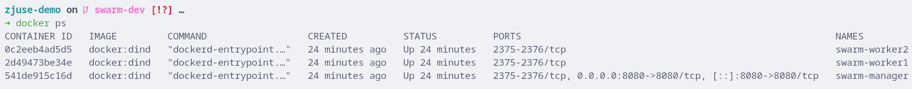
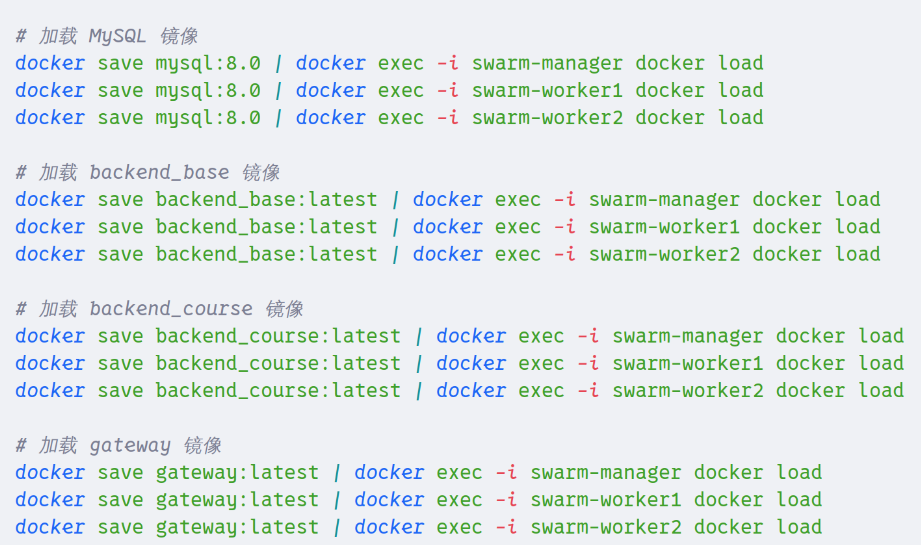
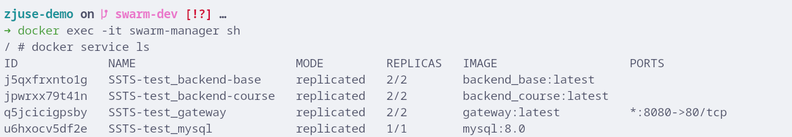
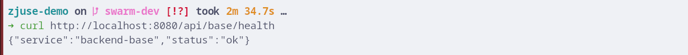

# Zjuse Swarm Demo

zjuse demo 在 Swarm 下的版本，用于单机环境下独立开发测试，模拟实际生产环境。

## Prerequisite

+ Docker
+ curl
+ make

## Usage

### Clone

github 账户需设置公钥，确保正常使用 ssh

完成后，拉取仓库，切换分支：

```bash
git clone --recurse-submodules git@github.com:uppi7/zjuse-demo.git
git checkout -b swarm-dev
git pull
```

### Build

1. 创建本地环境

```bash
make all
```

> 主要进行以下操作

单机环境下 DinD 创建多节点：

```bash
docker ps
```



---

模块打包本地镜像并传输到节点：



---

各节点部署：



---

部署完成后，网关被 Forward 到宿主机 8080 端口：



正常返回健康状态，后续本地开发子模块需与网关交互

2. 清理本地节点

```bash
make clean
```

删除 DinD 节点以及本地镜像

## Contribution

添加 demo 子模块后需要更改的文件位置：

1. Makefile：添加变量以及子模块路径
2. repo-infrastructure/gateway/nginx.conf：声明子模块代理
3. repo-infrastructure/scripts
   1. build.sh：创建子模块本地镜像，包括前端后端等，OT 需要将监考模块加入
   2. deploy.sh：环境变量注入节点
   3. load.sh：传输本地镜像到各节点
4. repo-infrastructure/init.sql：数据库初始脚本

5. repo-infrastructure/docker-stack.yml：添加服务信息
